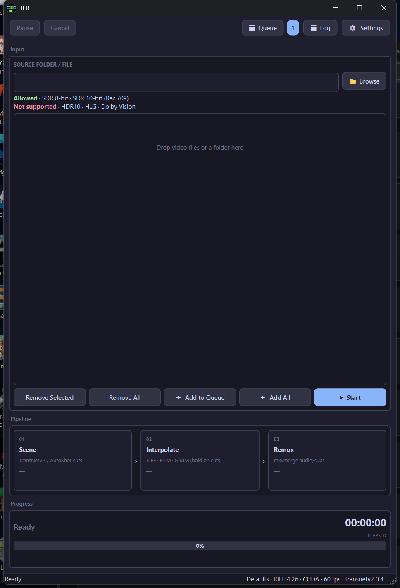
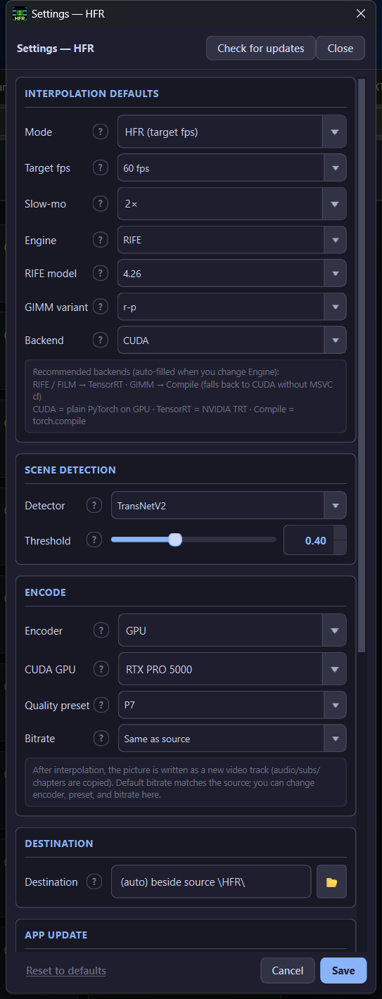

# HFR — High Frame-Rate Interpolation

  

  
  
  
  

---

## What is HFR? (plain English)

**HFR takes a normal video and makes the motion look smoother** by inventing the frames that sit *between* the ones you already have.

Example: a 24 fps movie → **60 fps** output. Playback looks fluid (less judder on pans and camera moves). You can also use it for **slow motion** (stretch time while keeping motion smooth).

You do **not** need to know AI, codecs, or command lines. The app is a Windows window:

1. Drop your video(s) in  
2. Click **Start**  
3. Wait — finished files land in a folder next to your source  

Under the hood it uses your **NVIDIA GPU**. It only accepts **SDR** video today (normal Rec.709). **HDR10 / HLG / Dolby Vision are not supported.**

### What happens to each file

| Step | In plain words |
|------|----------------|
| **1 · Scene** | Finds where the picture *cuts* to a new shot, so the AI does not blend two different scenes. |
| **2 · Interpolate** | Draws the missing frames (RIFE / FILM / GIMM) up to your target fps (default **60**). |
| **3 · Encode** | Writes a new video on the GPU (HEVC). |
| **4 · Remux** | Puts your **original audio, subtitles, and chapters** back into the new file. |

Defaults are already sensible: **RIFE**, **60 fps**, scene detect on, encode quality **P7**, bitrate **same as source**, output in a `\HFR\` folder beside the input.

---

## Screenshots

  

<em>Main window — drop videos, queue them, watch Scene → Interpolate → Remux.</em>

  

<em>Settings — target fps, engine (RIFE / FILM / GIMM), scene detector, GPU encode, destination.</em>

---

## How to use (quick start)

1. Install from [Releases](https://github.com/aberthil/HFR-releases/releases/latest) and open **HFR**.  
2. **Browse** or **drag-and-drop** SDR video files (or a folder).  
3. Optional: open **Settings** if you want a different fps, engine, or output folder.  
4. Click **+ Add to Queue** (or **Add All**), then **Start**.  
5. When it finishes, open the `\HFR\` folder next to your source (or whatever destination you set).

**Queue / Log / Settings** sit in the top-right. Pause and Cancel work while a job is running. You can stack many files and walk away.

---

## Download

| | |
|--|--|
| **Latest Setup** | [HFR-1.0.22-Setup.exe](https://github.com/aberthil/HFR-releases/releases/latest/download/HFR-1.0.22-Setup.exe) |
| **All versions** | [Releases](https://github.com/aberthil/HFR-releases/releases) |
| **SHA-256** | [HFR-1.0.22-Setup.exe.sha256](https://github.com/aberthil/HFR-releases/releases/latest/download/HFR-1.0.22-Setup.exe.sha256) |

> Prefer the **latest** tag always:  
> https://github.com/aberthil/HFR-releases/releases/latest

Installs to `C:\DolbyVisionScripts\HFR` by default. Your settings, Pushover keys, and queue live in AppData and **survive App Update**. Only a full **Remove** wipes them.

---

## Requirements

| | |
|--|--|
| OS | Windows 10/11 **x64** |
| GPU | **NVIDIA** (CUDA) — RTX recommended |
| Input | **SDR** 8-bit / 10-bit Rec.709 — not HDR10 / HLG / Dolby Vision |
| Disk | Setup ~250 MB + CUDA `.venv` created during install (needs network; can take several minutes) |

---

## Install

1. Download **HFR-*-Setup.exe** from [Releases](https://github.com/aberthil/HFR-releases/releases/latest)  
2. Run Setup (admin)  
3. Wait for the venv step (wizard progress + `install_venv.log`)  
4. Launch **HFR** from the Finish page / Start Menu  

**Repair venv later:** run `create_venv.cmd` in the install folder.  
**Update the app:** Settings → App update → Check → Update & Install  
(Tool updates and App update are separate.)

---

## Engines (when you care)

| Engine | Notes |
|--------|--------|
| **RIFE** (default) | Fastest everyday path (TensorRT) |
| **FILM** | Often smoother on hard / weird motion; slower |
| **GIMM** | Alternate look (`torch.compile` path) |

Scene detector default: **TransNetV2** @ threshold **0.4**. Encode default: **NVEncC** · preset **P7** · bitrate **same as source**.

---

## What's New

### v1.0.22

Preserve user settings on update (`gui_config` / `pushover` / `queue`).

Full history: [Releases](https://github.com/aberthil/HFR-releases/releases).

---

## Links

- **Latest download:** https://github.com/aberthil/HFR-releases/releases/latest  
- **This repo:** public Setup hosting + project page (source stays private)

---

## License / support

Windows installers for end users. Problems with a specific Setup: note the release tag and contact the publisher (`aberthil`).
